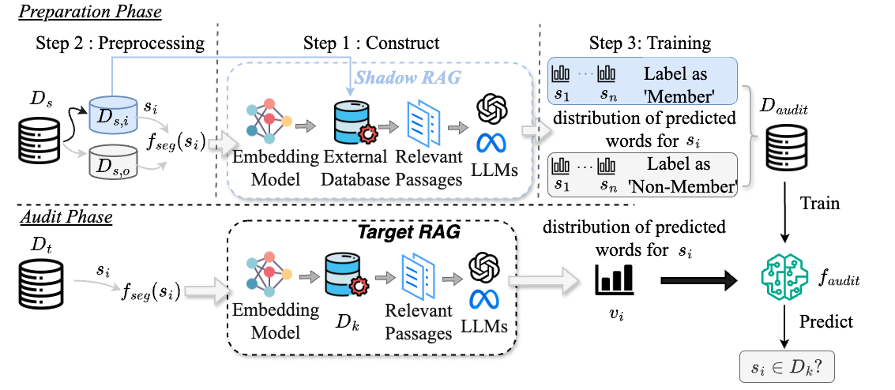

# RAG-privacy

Our paper is available at [S-RAG: A Novel Audit Framework for Detecting Unauthorized Use of Personal Data in RAG Systems](XXXX).

## Abstract

The growing trend of unauthorized collection and use of personal data, such as social media comments and search histories, by certain entities has become increasingly evident. To ensure compliance with data protection laws like the General Data Protection Regulation (GDPR) and to detect cases of improper use of personal information, We introduce the Shadow RAG Auditing Data Provenance method (S-RAG), an innovative and efficient audit framework designed to help users determine whether their textual data has been utilized in RAG systems. Furthermore, the method achieves an AUC of 94.6\% and 91.9\% when the target RAG system employs defense strategies against membership inference attacks. Finally, we analyze how the auditor's knowledge of the target RAG system influences auditing performance.



## Environmental installation

First, I suggest manually installing GPU-related libraries, selecting the version that is compatible with your CUDA version. You can find the compatible version at [torch install guide](https://pytorch.org/).

```
pip3 install torch torchvision torchaudio
```

Then, you should download the models in folder `.\Model`. For example, you may have the following file structure.

```
|-- Model
    |-- llama-3-8b-instruct
    |   |-- config.json
    |   |-- generation_config.json
    |   |-- model-00001-of-00004.safetensors
    |   |-- model-00002-of-00004.safetensors
    |   |-- model-00003-of-00004.safetensors
    |   |-- model-00004-of-00004.safetensors
    |   |-- model.safetensors.index.json
    |   |-- special_tokens_map.json
    |   |-- tokenizer_config.json
    |   |-- tokenizer.json
```

Finally, to install other required packages, you can use following methods

Install from the `requirements.txt` file:

```
pip install -r requirements.txt
```

## About the data

You can also find the origin datasets here: [HealthCareMagic-100k](https://huggingface.co/datasets/RafaelMPereira/HealthCareMagic-100k-Chat-Format-en) and [Reddit-travel-QA-finetuning](https://huggingface.co/datasets/soniawmeyer/reddit-travel-QA-finetuning).

Please unzip the datasets to the `.\Data` folder, you may find the following file structure.

```
|-- Data
    |-- HealthCareMagic-100k-en.jsonl
    |-- reddit_dot_scores_quality.csv
```

## Examples and illustrate

There are 3 steps to run our experiment: preparation, audit and evaluation results. Below is a brief introduction on how to run these Python script files, with detailed comments available for reference in each file.

### 1. preparation

In this section, we perform pre-processing on the datasets, construct the shadow RAG system and train an audit model.

You can use the following code to construct the shadow RAG for the training set of `HealthCare` using the `llama3` model and train an audit model.

```
python audit.py \
--dataset_name="HealthCare" \
--llm="llama3"\
--mode="prepare"\
--generate_prompts=True\
--generate_feature=True\
--generate_mask=True\
--build=True\
--split=True\
--train_audit_model=True\
--defence="wo"
```

You can change the parameter `llm` with value `gpt-4o`, but you must first enter your OpenAI API keys in the `Audit.py` file.

You can change the parameter `dataset_name` with value `reddit`.

You can also change the parameter `defence` with value `prompt_modify` and `paraphrasing`.

### 2. audit

To run audit, you can run following codes.

```
python audit.py \
--dataset_name="HealthCare" \
--llm="llama3"\
--mode="audit"\
--generate_prompts=True\
--generate_feature=True\
--build=True\
--split=True\
--defence="wo"
```

### 3. evaluation results

After the previous part of the code has finished running, you can use the following code to evaluate the results:

```
python evaluation_.py \
--dataset_name="HealthCare" \
--llm="llama3"\
--method="audit"\
--defence="wo"\
--audit_model=""
```

The `dataset_name` should be the same as previous code.

The `audit_model` refers to the model that was saved in step 1 of the process.

